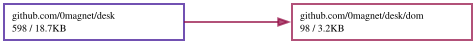

# desk

Windows over panes, in WebAssembly. A small desktop shell for the browser:
[winbox-go](https://github.com/0magnet/winbox-go) supplies the windows,
[websh](https://github.com/0magnet/websh) supplies a shell, and a pane is
anything that renders into a DOM element.

**[Live demo](https://0magnet.github.io/desk/)** · TinyGo build ·
[standard Go build](https://0magnet.github.io/desk/go/)

```
desk:~$ echo hello > note.txt && view note.txt    a command opens a window
desk:~$ open files                                or use the menu, bottom left
```

## What it is

```
desk.go            the registry: apps, windows, mounting, teardown
panel.go           the panel — Applications menu, task buttons, clock
compositor.go      the optional WebGL path: what to draw, where, in what order
compositor_js.go   the same path's WebGL2 calls
dom/               element building without the syscall/js ceremony

panes/                    a second module — see below
panes/term                a websh shell
panes/files               a file manager
panes/viewer              an image and text viewer, plus the `view` command
panes/cmd/desk            the demo
panes/cmd/desk-serve      a native binary that serves it, assets embedded
```

The shell knows nothing about terminals, images or files. A pane is:

```go
type Pane interface {
	Mount(el js.Value) error
	Close()
}
```

An app that a page opens with should set `Maximized`, so the desktop starts
with something filling it rather than a small window adrift in empty space.

`Resizer` is optional and most panes do not want it — one laid out with CSS is
resized by the browser, and one that watches its own element hears about it from
a `ResizeObserver`. The terminal pane does not implement it.

That is the point of the arrangement: a project brings its own pane rather than
waiting for this package to grow support for it.

## Compositing in WebGL, optionally

Off by default, and one call to turn on:

```go
if err := desk.EnableCompositing(); err != nil {
	// nothing has changed; the desk is the DOM desktop it already was
}
```

The DOM cannot be sampled into a WebGL texture, so compositing arbitrary panes
in WebGL would mean reimplementing layout, text and input in GL — a UI toolkit,
and not this project. A canvas *can* be a texture: `texImage2D` takes an
`HTMLCanvasElement` directly. So a pane says whether it is one:

```go
type TexturePane interface {
	Canvas() js.Value
}
```

A terminal running xterm-go's WebGL renderer has every glyph it shows in one
canvas, so `panes/term` implements it. Panes that do not are untouched.

Composited windows are drawn as textured quads with their chrome as flat
geometry; the DOM windows stay underneath at `opacity: 0`, so dragging,
resizing, focus and the keyboard are still the DOM's job and the compositor is
only a repaint. The title *text* is not drawn — the panel still has it.

Everything falls back, per frame and per window: no WebGL2 context, a pane that
is not canvas-backed, a canvas not sized yet, a lost context, or any exception
out of a GL call, and the window concerned — or the whole desk — is on the DOM
path again with one style property. The GL layer sits above every window and
below the panel, which is why only an unbroken run at the top of the stack is
composited: a composited window would otherwise paint over a DOM window that is
supposed to be in front of it.

## Two modules

The desk requires `winbox-go` and nothing else. It is a window manager, a
panel and a registry, and it does not know that a shell exists.

The panes are a separate module because each is an adapter that knows both
sides — `panes/term` knows the desk and websh. Putting that in the desk would
make a window manager require a shell; putting it in websh would make a shell
require a window manager. It belongs to neither, so it lives in its own module
next to what it adapts.

The two commands are there too, since both compose rather than provide. What
that buys: `go get github.com/0magnet/desk` brings winbox-go, and nothing
else — no shell, no filesystem, no interpreter.

They are developed together and released separately. The `replace` in
`panes/go.mod` points at `../` and is ignored by anything that depends on the
module, which is how a nested module is normally arranged.

## Running it

```
(cd panes && go run ./cmd/desk-serve)  # serves the built demo, opens a browser
./build.sh                       # rebuild both          -> docs/ and docs/go/
./build.sh tinygo                # TinyGo only
./build.sh go                    # standard Go only
```

Both toolchains are carried. TinyGo is the default because the binary is a
quarter the size and is fetched before anything appears; the standard Go build
is a click away in the page header, because TinyGo occasionally miscompiles
something and having the other one to hand is how you find out that is what
happened.

`desk-serve` embeds `docs/`, so it needs no checkout and no network. It exists
because a wasm page cannot be opened over `file://` — the browser refuses to
instantiate a module fetched that way — and because a wrong `Content-Type` on
the `.wasm` makes `instantiateStreaming` fail with an error that mentions
nothing about MIME types.

## The filesystem is the channel

Every pane shares one [afero](https://github.com/0magnet/afero) filesystem, so
handing a file from one window to another needs no message passing:

```
desk:~$ view report.svg
```

`view` only has to name the file. Writing it *was* the hand-off. The file
manager opens files the same way, through `desk.Lookup("viewer")` rather than
knowing what a viewer is — so registering a better viewer replaces it
everywhere at once.

## Fitting

A terminal in a window is resized by its container, never by the browser
window, so a `window.resize` listener never hears about it. xterm-go's
`AutoFit` observes the parent element instead:

```
window body  760x425  ->  terminal canvas  738x420
window body 1000x565  ->  terminal canvas  981x560
window body  500x285  ->  terminal canvas  477x280
```

## What it does not do

No workspaces, no session management, no multi-monitor, no file operations
beyond browsing. The panel and the menu are what make a collection of windows
read as a desktop; the rest is refinement on top of those two.
## Dependency Graph

Made with [goda](https://github.com/loov/goda):

```
# GOOS=js: the import edges of a wasm program live in js/wasm-tagged
# files and are invisible to a host-context run
GOOS=js GOARCH=wasm go run github.com/loov/goda@latest graph github.com/0magnet/desk/... | dot -Tsvg -o docs/desk-goda-graph.svg
```



## Lines of Code

Made with [gocloc](https://github.com/hhatto/gocloc) (excludes `vendor/`, `node_modules/`, `.git/`):

```
gocloc --not-match-d='(vendor|node_modules|\.git)' .
```

```
-------------------------------------------------------------------------------
Language                     files          blank        comment           code
-------------------------------------------------------------------------------
Go                              11            182            224           1188
JavaScript                       2            117             82            935
Markdown                         1             36              0            118
YAML                             1              0              7             98
HTML                             2              0              0             92
Makefile                         1             14             21             55
Bourne Shell                     2             13             29             50
JSON                             2              0              0             28
-------------------------------------------------------------------------------
TOTAL                           22            362            363           2564
-------------------------------------------------------------------------------
```
